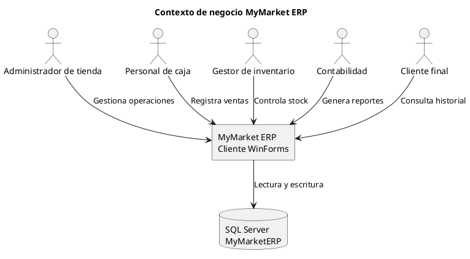
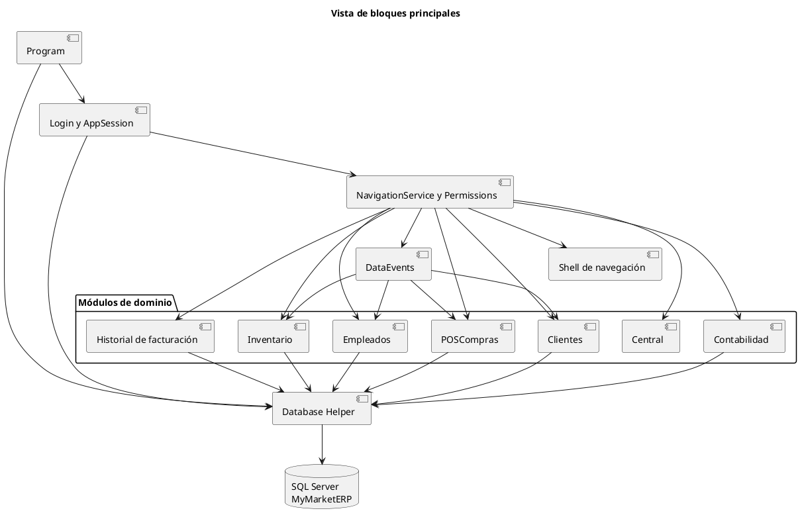
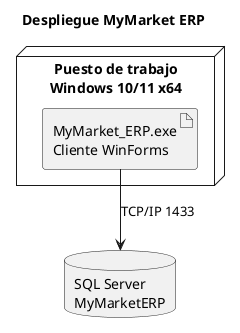

# Introducción y Metas {#section-introduction-and-goals}

## Vista de Requerimientos {#_vista_de_requerimientos}

MyMarket ERP es una aplicación de escritorio Windows Forms que unifica la operación diaria de un supermercado: ventas, clientes, inventario, contabilidad, empleados y consulta de historial. El sistema se organiza en formularios especializados que comparten autenticación centralizada, navegación lateral y permisos por rol.

Principales requerimientos funcionales identificados:

- Autenticación con correo y contraseña para todos los usuarios y apertura del tablero principal según el rol autenticado.
- Panel central con indicadores de ventas, analítica temporal y alertas de inventario/recursos humanos.
- Punto de venta que permita crear facturas, manejar carrito de productos, validar stock, registrar el método de pago y descontar inventario.
- Gestión completa de clientes (alta, edición, eliminación, filtros y búsqueda) con actualización en vivo entre formularios.
- Administración de inventario y órdenes de compra con filtros, paginación, panel de detalle y mantenimiento de productos críticos.
- Contabilidad básica: libro diario, balances, generación de asientos de ejemplo y exportación a Excel.
- Consulta de historial de facturación con filtros avanzados y detalle maestro–detalle, respetando el alcance de cada rol.
- Gestión de empleados con filtros por departamento/estado y panel de detalle sincronizado mediante eventos de datos.

## Metas de Calidad {#_metas_de_calidad}

| Meta | Descripción | Soporte en la implementación |
|------|-------------|------------------------------|
| Seguridad de acceso | Validación de credenciales, protección de sesiones y autorización por rol antes de abrir cada módulo. | `Login` compara las credenciales contra la base de datos, `AppSession` gestiona la sesión activa y `Permissions` junto a `NavigationService` bloquean el acceso no autorizado. |
| Experiencia consistente | Los formularios comparten instalación de barra lateral, estilos modernos y navegación homogénea. | `SidebarInstaller` embebe el formulario en un contenedor con barra lateral y sincroniza el ancho al colapsar/expandir; los módulos la reutilizan al inicializarse. |
| Sincronización de datos | Cambios en clientes, empleados, inventario, facturación, etc. se propagan automáticamente a otras vistas. | El bus `DataEvents` desacopla productores y consumidores con suscripciones débilmente referenciadas y publicaciones con debounce para evitar tormentas de eventos. |
| Mantenibilidad modular | Cada área de negocio encapsula su lógica en formularios dedicados y modelos propios, apoyados por servicios reutilizables. | Componentes como `Database.EnsureInitialized`, `AppSession`, `NavigationService` y `SidebarControl` centralizan responsabilidades transversales y reducen duplicación. |

## Partes interesadas (Stakeholders) {#_partes_interesadas_stakeholders}

+--------------------------+----------------------------+-------------------------------------------------------------+
| Rol/Nombre               | Contacto                   | Expectativas                                                |
+==========================+============================+=============================================================+
| Dirección / Admin        | Equipo interno             | Visibilidad integral de ventas, inventario y RR.HH.         |
+--------------------------+----------------------------+-------------------------------------------------------------+
| Contabilidad             | Contador corporativo       | Registrar asientos y exportar reportes contables.          |
+--------------------------+----------------------------+-------------------------------------------------------------+
| Caja                     | Supervisión de cajas       | Registrar ventas ágiles y confiables en el POS.            |
+--------------------------+----------------------------+-------------------------------------------------------------+
| Inventario               | Coordinador de bodega      | Controlar stock, órdenes de compra y productos críticos.    |
+--------------------------+----------------------------+-------------------------------------------------------------+
| Clientes finales         | Área de servicio al cliente| Consultar historial personal de facturación.               |
+--------------------------+----------------------------+-------------------------------------------------------------+
| Equipo TI                | Mesa de soporte            | Operar en Windows/.NET 9, conectar a SQL Server y mantener el despliegue. |
+--------------------------+----------------------------+-------------------------------------------------------------+

# Restricciones de la Arquitectura {#section-architecture-constraints}

- Plataforma: aplicación Windows Forms sobre .NET 9, restringida a sistemas operativos Windows x64.
- Base de datos corporativa: Microsoft SQL Server 2019+ accesible mediante cadena de conexión `MYMARKET_SQLSERVER_CS` y cliente `Microsoft.Data.SqlClient`.
- Despliegue monolítico: una única aplicación cliente que ejecuta consultas SQL directas y gestiona la inicialización del esquema en tiempo de arranque.
- Dependencias permitidas: `WinForms.DataVisualization` para analítica y `ClosedXML` para exportaciones contables.

# Alcance y Contexto del Sistema {#section-context-and-scope}

## Contexto de Negocio {#_contexto_de_negocio}

| Actor externo | Interacción con el sistema |
|---------------|---------------------------|
| Administrador de tienda | Controla métricas operativas, empleados y módulos maestros mediante el panel central. |
| Personal de caja | Registra compras, medios de pago y clientes vinculados desde el módulo POS. |
| Inventario | Administra órdenes y productos, coordinando reposiciones con proveedores registrados externamente. |
| Contabilidad | Consume datos de ventas y compras para elaborar estados financieros y exportarlos a Excel. |
| Clientes finales | Consultan su historial de facturación y detalles de compra según permisos del rol `cliente`. |

El siguiente diagrama de contexto resume las interacciones principales:

## Contexto Técnico {#_contexto_t_cnico}

| Elemento | Descripción |
|----------|-------------|
| Cliente WinForms | Ejecutable `MyMarket_ERP` que levanta `Database.EnsureInitialized`, crea el contexto de aplicación y renderiza formularios conforme al rol autenticado. |
| Servidor SQL Server | Base `MyMarketERP` con tablas `Users`, `Customers`, `Products`, `Invoices`, `InvoiceItems`, `Employees` y relaciones que el cliente crea y actualiza al iniciar. |
| Integraciones futuras | Actualmente no hay APIs externas; el bus interno `DataEvents` actúa como mecanismo de integración entre formularios dentro del cliente. |

# Estrategia de solución {#section-solution-strategy}

- **Inicialización automática de datos**: el cliente asegura el esquema y datos semilla en SQL Server antes de mostrar cualquier pantalla, evitando dependencias manuales de despliegue.
- **Shell reutilizable con barra lateral**: `SidebarInstaller` y `SidebarControl` encapsulan la navegación, manteniendo experiencia consistente y gestión de permisos por rol.
- **Servicios compartidos ligeros**: `AppSession` centraliza el estado de la sesión y `NavigationService` abre formularios controlando permisos y geometría.
- **Sincronización desacoplada**: `DataEvents` proporciona publicación/suscripción con referencias débiles y debounce para notificar cambios de datos sin bloquear la UI.
- **Procesos críticos con transacciones**: el POS encapsula la facturación en una transacción SQL, garantizando consistencia entre cabecera, detalle y stock.

# Vista de Bloques {#section-building-block-view}

## Sistema General de Caja Blanca {#_sistema_general_de_caja_blanca}

El sistema se compone de un ejecutable WinForms que orquesta formularios especializados apoyados por servicios transversales:

- **Bootstrap**: `Program` crea el `AppContext`, inicializa la base y mantiene viva la aplicación mientras existan formularios.
- **Persistencia**: `Database` abre conexiones SQL, ejecuta comandos de creación/seed y expone utilidades de acceso directo.
- **Sesión y seguridad**: `Login`, `AppSession`, `Permissions` y `NavigationService` autentican y autorizan el acceso a módulos.
- **Shell UI**: `SidebarInstaller`, `SidebarControl` y botones asociados proveen navegación consistente y persistencia del estado colapsado.
- **Bus de eventos**: `DataEvents` propaga cambios entre formularios sin acoplamiento fuerte.
- **Módulos de dominio**: formularios `Central`, `POSCompras`, `Clientes`, `Inventario`, `Contabilidad`, `Historial_facturacion` y `Empleados` encapsulan la lógica de cada área.

El siguiente diagrama ilustra los bloques principales y sus relaciones:

### Bootstrap de la aplicación {#__bootstrap_de_la_aplicacin}

- **Propósito**: garantizar que el esquema de datos existe y arrancar el ciclo de formularios controlado por `AppContext`.
- **Interfaces**: invoca a `Database.EnsureInitialized`, abre el formulario de `Login` y detecta el cierre de la última ventana para finalizar el hilo de UI.

### Servicios de sesión y navegación {#__servicios_de_sesin_y_navegacin}

- **Propósito**: autenticar, almacenar el usuario activo y abrir módulos permitidos controlando tamaño/posición de ventanas.
- **Interfaces**: `Login` interactúa con `Database` para validar credenciales, `AppSession` guarda el estado y `NavigationService` instancia formularios según `NavSection` si el rol lo permite.

### Shell reutilizable {#__shell_reutilizable}

- **Propósito**: dotar a todos los formularios de una barra lateral consistente con botones habilitados según permisos.
- **Interfaces**: `SidebarInstaller.Install` reacomoda los controles del formulario en un `SplitContainer`, mientras `SidebarControl` construye botones y publica eventos `SectionClicked` y `SidebarWidthChanged` consumidos por `NavigationService`.

### Bus de eventos de datos {#__bus_de_eventos_de_datos}

- **Propósito**: notificar cambios (clientes, empleados, inventario, facturación) a otros formularios sin referencias directas.
- **Interfaces**: métodos `Subscribe*` reciben un `Control` y un `Action`; `Publish*` dispara eventos con `DataEventPayload` tras un debounce configurable.

### Módulos funcionales {#__mdulos_funcionales}

- **Central**: consulta métricas clave e inicializa gráficos y alertas de stock, apoyándose en consultas agregadas a `Invoices`, `Products` y `Employees`.
- **POSCompras**: mantiene un carrito en memoria, calcula impuestos, resuelve cliente asociado, inserta cabecera/detalle de factura y actualiza inventario dentro de una transacción SQL.
- **Clientes**: lista, filtra y edita clientes con recargas asincrónicas y manejo de selección persistente, escuchando eventos `DataEvents`.
- **Inventario**: combina grid de órdenes con panel de detalle y catálogo de productos paginado, permitiendo acciones sobre proveedores y productos críticos.
- **Contabilidad**: arma el libro diario en `DataTable`, calcula balances/ER y exporta pestañas activas a Excel mediante `ClosedXML`.
- **Historial de facturación**: ofrece filtros combinables, carga diferida y control de acceso diferenciado para admin vs cliente final.
- **Empleados**: administra personal con filtros dinámicos y panel plegable, refrescando datos ante eventos `EmpleadosChanged`.

## Nivel 2 {#_nivel_2}

Los módulos se apoyan en modelos simples (clases `Customer`, `Employee`, `CartItem`, etc.) declarados en los mismos archivos para minimizar dependencias. La lógica de acceso a datos se concentra en cada formulario, usando `Database.OpenConnection` y comandos parametrizados.

## Nivel 3 {#_nivel_3}

En este proyecto WinForms, los subcomponentes de nivel 3 corresponden a controles reutilizables (`SidebarButton`, `ModernCard`, `ModernTheme`) que encapsulan comportamiento visual. Su integración se realiza desde el diseñador y no introduce dependencias lógicas adicionales.

# Vista de Ejecución {#section-runtime-view}

## Escenario de ejecución 1: Inicio de sesión {#__escenario_de_ejecuci_n_1}

1. `Program.Main` invoca `Database.EnsureInitialized()` y abre el formulario `Login` dentro de `AppContext` para mantener la aplicación viva.
2. El usuario ingresa credenciales; `Login` valida formato, consulta `dbo.Users` y compara la contraseña ingresada con la almacenada para confirmar el rol asociado.
3. Si el rol corresponde a `cliente`, se asocia un `CustomerId`; en cualquier caso se llama a `AppSession.StartSession` y se navega al formulario permitido usando `NavigationService`.

## Escenario de ejecución 2: Venta en el POS {#__escenario_de_ejecuci_n_2}

1. `POSCompras` carga el catálogo de productos activos y configura autocompletado y métodos de pago al mostrarse.
2. Al cobrar, valida que haya productos y calcula subtotal/IVA/total. Resuelve el cliente por correo, documento o nombre.
3. Dentro de una transacción SQL, inserta la factura, detalla cada ítem y descuenta stock asegurando disponibilidad; en caso de error revierte y notifica al usuario.
4. Tras commit, recarga la caché de productos, limpia el carrito y publica eventos de facturación (mediante `DataEvents`) si se requiere, permitiendo que otros módulos reaccionen.

## Escenario de ejecución 3: Actualización de clientes {#__escenario_de_ejecuci_n_3}

1. `Clientes` se suscribe a `DataEvents.SubscribeClientes` al inicializarse y solicita la carga inicial asincrónica.
2. Cuando otro formulario publica un evento `ClientesChanged`, se dispara una recarga cancelable que ejecuta una consulta `SELECT` ordenada para poblar la grilla.
3. Tras obtener los datos, reaplica filtros, mantiene la selección anterior y actualiza indicadores de estado en la UI.

# Vista de Despliegue {#section-deployment-view}

## Nivel de infraestructura 1 {#_nivel_de_infraestructura_1}

La solución se despliega como un cliente pesado en estaciones Windows 10/11 x64 con .NET 9 instalado. Cada estación se conecta a una instancia de SQL Server (local o en red corporativa) usando autenticación Windows o SQL Server configurada en la variable `MYMARKET_SQLSERVER_CS`. `Database.EnsureInitialized` se ejecuta en el primer arranque para crear tablas e índices, por lo que el servidor debe permitir ejecución de scripts DDL desde la aplicación cliente.

Mapeo de bloques a infraestructura:

- `MyMarket_ERP.exe` (WinForms) se ejecuta en el puesto de trabajo y contiene todos los módulos funcionales.
- `MyMarketERP` (SQL Server) aloja datos persistentes de usuarios, productos, facturas, clientes y empleados.

El despliegue se resume en el siguiente diagrama:

## Nivel de Infraestructura 2 {#_nivel_de_infraestructura_2}

No se contemplan nodos adicionales en esta iteración; la comunicación se limita al cliente y la base de datos corporativa. Integraciones con sistemas externos (facturación electrónica, proveedores) quedarían para iteraciones futuras.

# Conceptos Transversales (Cross-cutting) {#section-concepts}

## Seguridad y control de acceso {#__seguridad_y_control_de_acceso}

Las contraseñas se almacenan en la tabla `Users` y se validan de forma centralizada antes de abrir cualquier módulo. `Permissions` define un mapa de roles a secciones, aplicado por `NavigationService` y materializado en la barra lateral que solo muestra accesos permitidos.

## Sincronización de datos y consistencia {#__sincronizacin_de_datos_y_consistencia}

`DataEvents` gestiona suscripciones por control, elimina referencias muertas y aplica debounce para evitar tormentas de eventos, permitiendo que módulos como Clientes y Empleados reaccionen a cambios sin bloquear la UI. Los procesos críticos (facturación) usan transacciones para mantener integridad referencial entre facturas, detalle e inventario.

## Experiencia de usuario y shell común {#__experiencia_de_usuario_y_shell_comn}

`SidebarInstaller` reestructura cada formulario para insertarlo en un `SplitContainer` con barra lateral, ajustando automáticamente el ancho y forzando `PerformLayout` tras cada cambio. `SidebarControl` guarda un estado global de colapso, muestra tooltips cuando está contraída y emite eventos de navegación reutilizados por todos los módulos.

# Decisiones de Diseño {#section-design-decisions}

- Adoptar un cliente WinForms monolítico para acelerar la entrega del Sprint 1, reutilizando controles visuales y minimizando infraestructura adicional.
- Gestionar la base con scripts SQL embebidos en código para evitar dependencias de herramientas externas y permitir despliegues “click-once”.
- Centralizar la navegación lateral y los permisos en componentes reutilizables (`SidebarControl`, `Permissions`, `NavigationService`) que simplifican la adición de nuevos módulos.
- Utilizar un bus de eventos in-process (`DataEvents`) con referencias débiles para evitar fugas de memoria en formularios que se abren y cierran repetidamente.

# Requerimientos de Calidad {#section-quality-scenarios}

## Árbol de Calidad {#__rbol_de_calidad}

- **Seguridad**
  - Confidencialidad de credenciales (validación centralizada y sesiones por rol).
  - Control de acceso por rol (navegación condicionada).
- **Usabilidad**
  - Navegación uniforme mediante barra lateral y atajos (Enter para login, autocompletado en POS).
  - Visualizaciones y filtros en dashboards y listados.
- **Confiabilidad**
  - Transacciones ACID en facturación, validaciones de stock y manejo de excepciones.
  - Debounce de eventos para evitar cargas simultáneas innecesarias.
- **Mantenibilidad**
  - Componentes transversales reutilizables y módulos aislados por dominio.

## Escenarios de calidad {#_escenarios_de_calidad}

1. **Seguridad**: si un usuario intenta iniciar sesión con credenciales inválidas, `Login` bloquea el acceso, limpia el campo de contraseña y mantiene la sesión cerrada, protegiendo la confidencialidad.
2. **Disponibilidad de datos**: al registrar una venta con stock insuficiente, el POS revierte la transacción y notifica el error, evitando inconsistencia entre inventario y facturación.
3. **Mantenibilidad**: al agregar un nuevo módulo, basta con definir la sección en `NavSection`, mapearla en `Permissions` y crear el formulario que use `SidebarInstaller`, replicando el patrón existente sin tocar otros formularios.

# Riesgos y deuda técnica {#section-technical-risks}

- **Bloqueo de UI por operaciones sincrónicas**: varias consultas se ejecutan en el hilo principal (ej. POS, inventario). Aunque algunos formularios usan `Task.Run`, se recomienda migrar a operaciones asincrónicas en toda la app para mejorar la respuesta.
- **Scripts SQL embebidos**: cambios de esquema requieren recompilar el ejecutable; considerar migraciones versionadas para ambientes mayores.
- **Ausencia de pruebas automatizadas**: el proyecto actual carece de tests unitarios/integración, por lo que las validaciones dependen de pruebas manuales documentadas por el equipo.

# Glosario {#section-glossary}

+-----------------------+---------------------------------------------------------------+
| Término               | Definición                                                    |
+=======================+===============================================================+
| POS                   | Punto de venta utilizado por el personal de caja para facturar compras. |
+-----------------------+---------------------------------------------------------------+
| Sidebar               | Barra lateral de navegación que lista módulos habilitados según el rol del usuario. |
+-----------------------+---------------------------------------------------------------+
| DataEvents            | Bus interno de publicación/suscripción que sincroniza formularios tras cambios de datos. |
+-----------------------+---------------------------------------------------------------+
| Libro diario          | Tabla contable que registra movimientos de debe/haber y alimenta balances. |
+-----------------------+---------------------------------------------------------------+
| Seed                  | Conjunto de datos semilla insertados automáticamente en SQL Server durante la inicialización. |
+-----------------------+---------------------------------------------------------------+
